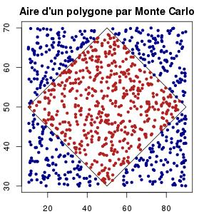
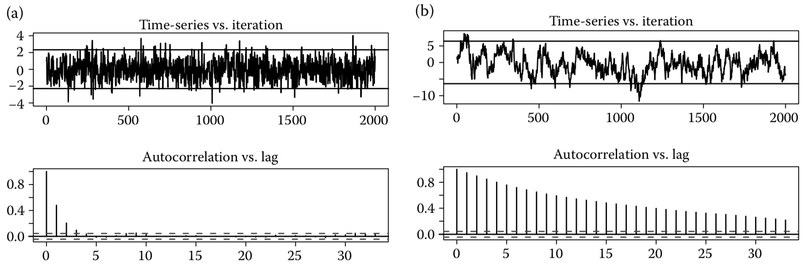

```{r setup, include=FALSE}
options(htmltools.dir.version = FALSE)
```

<!-- --- -->
<!-- class: center, middle -->

<!-- # xaringan -->

<!-- ### /ʃaː.'riŋ.ɡan/ -->

---
class: inverse, center, middle
# Warmup

---

## Logique de diagnostic

--

### Diagnostic in Real life :

- A doctor can never prove that you are **healthy**.
    - If (no **medical test** shows any sign of you being **sick**)
    - Then (they **consider / believe** you are **healthy**).

--

### Diagnostic of MCMC (<span style="color:red">Take-home message</span>) :
- You can never prove that MCMC chains **converge**.
    - If (no **statistical diagnostic / test** shows any sign of **divergence**)
    - Then (you **admet / believe** the chains **converge**).

--

**One-vote veto**
$$\small\exists\; \text{diagnostic showing non-divergence } \Rightarrow \mathbb{P}(\text{convergence}) = 1- \mathbb{P}(\text{divergence}) = 0 $$

--

**The more, the better**
$$\small nb(\text{diagnostic showing non-divergence}) \nearrow \quad \Rightarrow \mathbb{P}(\text{convergence}) \nearrow$$

---

## Logique (mathématique) :

- Si MCMC converge (noté $P$), alors on a $Q_1$ et $Q_2$ et $Q_3$ et $\ldots$
$$\small P \Rightarrow \left\{
Q_1 \;\text{and}\;  Q_2 \;\text{and}\;  Q_3 \;\text{and}\;  \cdots
\right\}$$

D'une manière équivalente :

- Si on n'a pas $Q_1$ ou n'a pas $Q_2$ ou n'a pas $Q_3$ ou ..., alors diverge (noté $\neg P$) 
$$\small \left\{
\neg Q_1 \;\text{or}\;  \neg Q_2 \;\text{or}\;  \neg Q_3 \;\text{or}\;  \cdots
\right\} \Rightarrow \neg P$$

--

**Probabilistic interpertation :**

- S'il existe un diagnostic qui <span style="color:blue">va mal</span>, alors <span style="color:green">divergence</span> :
$$\small \mathbb{P}({\color{green}{\neg P} } \mid \color{blue}\neg Q_1 \; {\text{or}} \; \color{blue}\neg Q_2 \;\text{or}\; \color{blue}\neg Q_3 \;\text{or}\; \cdots ) = 1$$


- Si <span style="color:red">rien</span> ne <span style="color:blue">va mal</span>, alors plus de diagnostics réduisent la proba de <span style="color:green">divergence</span> :
$$\small \begin{align*}\mathbb{P}\left( \color{green}{\neg P} \mid \color{red}\neg ( \color{blue}\neg Q_1) \right) \quad 
& \geq \; \mathbb{P}\left( \color{green}{\neg P} \mid \color{red}\neg ( \color{blue}\neg Q_1 \; {\text{or}} \; \color{blue}\neg Q_2)\right) \\ 
& \geq \; \mathbb{P}\left( \color{green}{\neg P} \mid \color{red}\neg ( \color{blue}\neg Q_1 \; {\text{or}} \; \color{blue}\neg Q_2 \;\text{or}\; \color{blue}\neg Q_3) \right) \\
& \geq \; \mathbb{P}\left( \color{green}{\neg P} \mid \color{red}\neg ( \color{blue}\neg Q_1 \; {\text{or}} \; \color{blue}\neg Q_2 \;\text{or}\; \color{blue}\neg Q_3 \;\text{or}\; \cdots)\right) \\
\end{align*}$$

---
class: inverse, middle, center

# Modélisation

Que fait MCMC ?

---

### Modélisation : **Context**, **Model** and **Data**

--

.pull-left[
```{r echo=FALSE, cache=FALSE, fig.height = 5}
library(DiagrammeR)
grViz("img-modelisation-model-data.gv")
```
]

--

.pull-right[
```{r echo=FALSE, cache=FALSE, fig.height = 5}
grViz("img-modelisation-data-model.gv")
```
]

--

A un moment donné, on a

- Context
- Model (paramétrique)
- Data

--

<span style="color:red">Message</span> : Le modèle doit être <span style="color:red">paramétrique</span> pour utiliser la méthode MCMC.

---

### Modélisation : Parameter learning $\tiny\text{/ inference / calibration / estimation}$

- Use **Data** to update what we know about parameters.

--

#### Approaches :

- Frequentist inference approach
    - Use **Likelihood** to learn parameters $\theta$ from data $\mathcal{D}$
- <span style="color:red">**Bayesian**</span> inference approach
    - Use **Likelihood** to update the **prior** distribution of parameters
    
$$Posterior(\theta \mid \mathcal{D}) \propto Likelihood(\theta, \mathcal{D}) \times Prior(\theta)$$

--
```{r echo=FALSE, cache=FALSE, fig.height = 3.5}
grViz("img-bayes-inference.gv")
```


---

### Why Monte Carlo simulation ?

#### Example : estimater l'aire par simulation Monte Carlo

.pull-left[
```{r echo=FALSE, out.width = "150px"}
## Definition d'une fonction très utile
creer_polygone <- function (x,y) {
  matrix(c(x, x[1], y, y[1]), ncol=2,dimnames=list(c(), c("x","y")))
}
losange <- creer_polygone(c(50,10,50,90),c(30,50,70,50))
plot(losange, type='l',xlab = "x", ylab = "y", main = "Aire du polygone à estimer") 
```
]

--

.pull-right[
```{r echo=FALSE, out.width = "150px"}

```
]

--

- **Ci-dessus**, simulation Monte Carlo : Méthode générale pour calculer l'**aire**

$$\small \frac{nb(Rouges)}{nb(Total)} * Aire(Total) \longrightarrow Aire(polygone)$$

--

- Dans l'**apprentissage des paramètres** (avec l'approche Bayésienne), MCMC : méthode générale pour la distribution *a postériori*. *e.g.*

$$\small Hist(MCMC\,samples) \longrightarrow Posterior(\theta \mid \mathcal{D})$$

--

<span style="color:red">Approximation MCMC</span> marche si les chaines <span style="color:red">convergent</span> !!!

---
class: inverse, middle, center

# MCMC : Workflow / Strategy

Biblio : Handbook of MCMC chap 6

by 
- Andrew Gelman
- Kenneth Shirley

---

1. Simulate three or more chains in parallel with random start.

--
2. Check <span style="color:red">convergence</span> (coda, <span style="color:red">shinystan</span>)
    - Within-chain analysis to monitor stationarity (e.g. traceplot)
    - between/within chains comparisons to monitor mixing (e.g. $\color{red}{\hat{R}}$)
--
3. If no sign of divergence, mix all the simulations from the second halves of the chains together to summarize the target distribution.
    - summary : (coda / <span style="color:red">shinystan</span>)
        - maximum a posteriori / mean a posteriori
        - quantiles
        - mcmc stander error
        - effective sample size
--
4. If divergence detected, 
    - possible reasons :
        - too short chains
        - Programming error (sometimes difficult to find)
        - Poor priors
        - Parameters are too correlated (identifiability problem)
        - complex posterior
        - Wrong model !!!
    - possible solutions : 
        - long run (continue from where last MCMC ended)
--
5. If long run does not solve the problem
    - back to change model / change parametrization
    - ~~back to mcmc algorithms~~ (partially done by MCsim)
--
6. Compare inferences to those from simpler models or approximations
    - programming errors / actual changes in inferences.

---
class: inverse, middle, center

# MCMC : Diagnostics

With demo in shinystan

---

## Recalls

### Possible reasons of divergence :
- too short chains
- Programming error (sometimes difficult to find)
- Poor priors
- Parameters are too correlated (identifiability problem)
- complex posterior
- Wrong model !!!

### Diagnostic of MCMC (<span style="color:red">Take-home message</span>) :
- You can never prove that MCMC chains **converge**.
    - If (no **statistical diagnostic / test** shows any sign of **divergence**)
    - Then (you **admet / believe** the chains **converge**).

---

## Brainstorming : how to check divergence

Any suggestion ?

### Recall : Possible reasons of divergence :
- too short chains : high correlation, start value bias
- Programming error (sometimes difficult to find)
- Poor priors
- Parameters are too correlated (identifiability problem)
- complex posterior
- Wrong model !!!

<!-- ??? -->

<!-- - Trace plot -->
<!-- - autocorrelation -->
<!-- - n_effectif -->
<!-- - R_hat -->
<!-- - MAP -->
<!-- - Histogramme marginal / Kernel Density Estimate -->

---

## How to check divergence (méthode générale)

```{r echo=FALSE}

```

- $\hat{R} \simeq 1$, $\hat{R} \leq 1.1$
- $N_{eff}$ estimé suffisamment grand et $N_{eff} / N_{total}$ grand
- auto correlation
- correlation

---
class: inverse, middle, center

# Demo in shinystan

source code available [here](https://github.com/AntoineChn/ShinyStanForMCsim)
